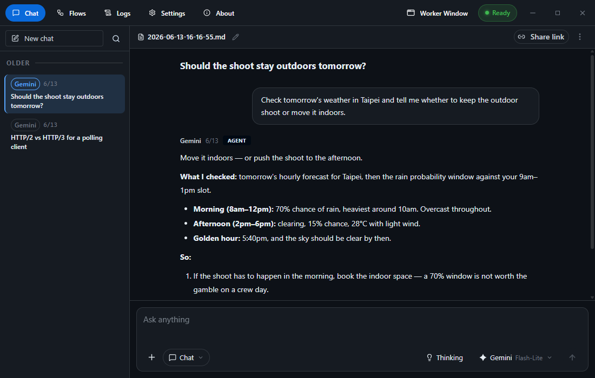

<div align="center">

# Yobi

**AI automation for the desktop. Flows run on your own machine, work with the apps installed on it, and need no AI API key.**

[](LICENSE)
[](#get-started)
[](https://apps.microsoft.com/detail/9nnx8prfstc9)
[](https://www.electronjs.org/)
[](https://github.com/WellWells/yobi/pulls)

**[English](README.md) · [简体中文](README.zh-CN.md) · [繁體中文](README.zh-TW.md)**

</div>

---

**Yobi** is a flow engine that runs on your desktop. Chain data, AI and actions into an automation, then trigger it on a schedule, from a global hotkey, from a Telegram or LINE message, or from a slash command in the app. Because it runs on your machine rather than a server, a flow reaches what a hosted tool cannot: the LINE and Thunderbird apps installed here, your files, your shell, a real browser. The AI steps drive the providers' own web pages, so there is no API key and no per-token bill.

---

## Why Yobi

| Feature | What it does |
| ------- | ------------ |
| **No-code flows** | 47 kinds of step, chained with `{{variables}}`. Drag them together, or describe the automation and let AI build it. |
| **Runs on your PC** | Flows reach the LINE and Thunderbird apps on this machine, plus your files, your shell and a browser window. Nothing to host. |
| **No API key** | AI steps drive the providers' web pages, not paid APIs. Add your own key only if you want to (BYOK). |
| **An agent that acts** | `/agent` takes a goal, picks its own tools, and asks before it changes anything. |
| **Connectors** | Notion, GitHub, Figma, Stripe and more, plus LINE and Thunderbird on this PC. |
| **Four ways to trigger** | Schedule, global hotkey, Telegram or LINE message, in-app slash command. One flow can use several. |
| **Every major AI** | ChatGPT, Claude, Gemini and Perplexity, each with its own models and thinking effort. |
| **No middleman** | Yobi runs no server of its own. Prompts go to the AI site you picked; everything else stays on your disk. |
| **Multilingual** | English, 繁體中文 and 简体中文 built in, plus drop-in language packs ([guide](language/README.md)). |

---

## Flows

A flow is a chain of steps. Each step's output feeds the next through `{{variables}}`:

```
Schedule   every weekday at 08:00
    ↓
LINE       → {{chat}}      yesterday's messages from a group
    ↓
Ask AI     → {{summary}}   summarize, pull out decisions and open items
    ↓
Telegram   send {{summary}}
```

You don't have to build one by hand. Describe what you want and AI assembles the whole flow out of the steps below, every one of them still editable afterwards:

> *"Every weekday at 8am, summarize my RSS feed and send it to Telegram."*

The flow above also ships as a template, along with others to start from — some scheduled, some fired as a slash command.

**The steps, by kind:**

- **Pull data** — web pages, RSS, HTTP APIs, YouTube transcripts, web search, Google Maps reviews, LINE chats, live stock / forex / weather / air quality
- **Scrape a list** — click one headline on the real page; Yobi works out the selectors for the rest
- **Drive a browser** — open tabs, click, fill forms, take screenshots
- **Ask AI** — ChatGPT, Claude, Gemini, Perplexity, or BYOK
- **Send results** — Telegram, LINE, email through your own SMTP account, a file, a share link, the clipboard
- **Run anything** — programs, JavaScript, shell, plus system and power controls
- **Control flow** — loops, conditions, scheduling, and "only tell me when it changes"

Flows are plain `.json` files. Export, share and import them in a click.

---

## What a Flow Can Reach

**On this PC.** Both work against an application installed here, not a cloud account:

- **LINE** (Windows) — list chats, search messages, pull a conversation. Nothing is sent to LINE and nothing is marked as read. Also available as the LINE flow step.
- **Thunderbird** — search and read mail, reply, forward, file it away, plus calendar, tasks and contacts.

**Cloud services.** Sign in once and the connector's tools are available to `/agent`:

- **Work** — Notion · Linear · Asana · Atlassian (Jira & Confluence) · Airtable · Dropbox · Zapier
- **Dev** — GitHub · Sentry · Vercel · Netlify · Supabase · Neon · Cloudflare
- **Design** — Figma · Webflow · Wix
- **Business** — Stripe · Square · PayPal · Intercom
- **Reference** — Context7 · DeepWiki · Microsoft Learn · Cloudflare Docs · Hugging Face

Anything else that speaks MCP works too: paste its URL. Switch any of them on in **Settings → Connectors**, which also walks you through whatever a connector needs. Everything stays off until you do, and anything that writes asks for confirmation first.

---

## Triggers

| Trigger | For |
| ------- | --- |
| **Schedule** | A digest that arrives every weekday morning |
| **Global hotkey** | Select text in any app, press `Alt+G` (`⌘⌃G` on macOS), get an answer back and saved |
| **Telegram or LINE message** | Running a flow from your phone |
| **Slash command** | `/yourflow`, typed in the app's chat box |

---

## The Agent

Give `/agent` a goal instead of a prompt. It plans, searches, calls its tools, checks its own work, and can write the result into a flow so it runs on a schedule from then on. Reading is free; a shell command, a file write, an email or any connector tool that changes something needs your confirmation. File access is sandboxed to folders you allow, and anything shaped like a key or token is masked before the model sees it.

In chat, tick **Web** or a connector in the pill under the input and the conversation runs as an agent. Otherwise it stays a normal multi-turn conversation, saved as a Markdown file you can reopen and carry on. `Shift+Tab` cycles providers and their models. Answers render as they arrive, Mermaid diagrams and math included, and any of them exports to PNG, PDF or an end-to-end encrypted share link.

Personal memory holds short facts about you: your city, what you're working on, how you like your answers. The AI proposes them as you chat, and nothing is saved until you approve it.

---

## Get Started

**1. Download** the latest release for your OS:

| Platform | Download | Notes |
| -------- | -------- | ----- |
| **Windows** | [**Microsoft Store**](https://apps.microsoft.com/detail/9nnx8prfstc9) **(Recommended)** | Installs and updates automatically. |
| **Windows** | [GitHub Releases](https://github.com/WellWells/yobi/releases) — NSIS installer (x64) | Unsigned, so Windows prompts on first launch. Choose **More info → Run anyway**. |
| **macOS** | [GitHub Releases](https://github.com/WellWells/yobi/releases) — DMG (Intel & Apple Silicon) | Unsigned, so Gatekeeper blocks the first launch. The [release notes](https://github.com/WellWells/yobi/releases) explain how to open it. |

**2. Run something in 30 seconds:**

1. (Optional) Open the in-app browser and sign in to ChatGPT / Claude / Gemini / Perplexity.
2. Highlight any text, in any app.
3. Press **`Alt+G`**. Yobi sends it to your chosen AI and saves the reply as a timestamped Markdown file.

From there, open **Flows** and start from a template.

<details>
<summary><b>Run from source instead</b> (Node.js 22.12+)</summary>

```bash
git clone https://github.com/WellWells/yobi.git
cd yobi
npm install
npm run dev
```
</details>

---

## Screenshots

| Flow Editor | `/agent` in Action |
| :---------: | :----------------: |
|  |  |
| Fetch, summarize with AI, send to Telegram, on a schedule | Give it a goal; it picks the tools and runs them |

| Main Chat Interface | Model Selection |
| :-----------------: | :-------------: |
|  |  |
| Chat with AI through its web interface | Switch provider, and pick each one's own model |

| Chat History & Summary | Export Options |
| :--------------------: | :------------: |
|  |  |
| Auto-saved responses with timestamps | Export as PNG, WebP or PDF with custom styles |

---

## Run It From Telegram or LINE

Connect a bot and you can use your AI and your flows from your phone. Setup takes about two minutes:

1. **Create a bot** — message [@BotFather](https://t.me/BotFather) and copy the token it gives you. (For LINE, create a Messaging API channel instead.)
2. **Paste the token** in **Settings → Telegram** (or **LINE**).
3. **Say `/start`** to your bot and follow the pairing prompt.

| Command | Does |
| ------- | ---- |
| `/gpt` · `/claude` · `/gemini` · `/pplx` | Ask that provider (commands are customizable) |
| `/agent` | Hand it a goal, same as in the app |
| `/search` | Search the web and answer with sources (bots only) |
| `/new` | Start a fresh conversation |
| `/output <mode>` | Set reply format: `md` · `png` · `webp` · `pdf` |
| `/status` | Check the agent |
| `/restart` | Restart Yobi (admin) |

You can skip commands entirely: turn on **direct chat** in the bot's settings and plain messages go straight to your AI as a normal conversation.

The **Bot trigger** in Flows turns any message into a command of your own, on either platform.

---

## Settings

General · Keyboard shortcuts · Appearance · Export · AI Responses · Personal memory · Model Sources · Connectors · Bot Integrations · Statistics · Backup & Restore.

**Model Sources** is also where BYOK lives: add an OpenAI-compatible endpoint or a Gemini API key as an extra provider, and it becomes selectable in chat and in flows like any other. **Backup & Restore** writes everything to a single JSON file.

---

## How Yobi Works

The AI steps automate the **web interfaces** of ChatGPT, Claude, Gemini and Perplexity. In a built-in browser window Yobi types your prompt into the provider's site and reads the answer back from the page, the same thing you'd do by hand. You sign in there only for providers that require it. It uses **no official API and no local model**, which is exactly why it needs no API key and has no fee. (The optional BYOK mode calls an OpenAI-compatible endpoint or the Gemini API directly instead; everything below applies to the default browser mode.)

Using the web pages rather than official APIs falls outside the providers' terms of service. Yobi bypasses no protections, though: no solving CAPTCHAs, no evading rate limits, no rotating IPs. In practice the most you'll run into is an anti-bot check, a Cloudflare-style "verify you're human" page, and when that happens Yobi pauses and hands control back to you to clear it manually.

**Please use Yobi responsibly**: nothing illegal, and no large-scale or abusive automation. Light personal use is usually just the occasional verification prompt; heavy or abusive use is what gets blocked. Whether to use it on this basis is your call, and providers' terms can change, so check them yourself. This isn't legal advice.

---

## Security & Privacy

- **Where your prompts go** — to the AI site you picked, typed into its own web page. That's the one place your text goes, and it's subject to that provider's privacy policy.
- **No middleman, no telemetry** — Yobi has no server and no account, so nothing is proxied through us and there's zero analytics. Conversations, flows and exports are plain files on your disk, and the automation logic is auditable in `src/main/`.
- **Anything else that leaves your machine is opt-in** — web search goes to DuckDuckGo only while **Web** is on. Share links are encrypted in the app before upload, and the key lives in the link's `#fragment`, which browsers never send to the host. Connectors talk only to the services you sign in to, and the LINE and Thunderbird ones talk only to the app on this machine.
- **The agent asks before it acts** — reading is free, writing isn't. A shell command, a file, an email or a connector tool that changes something all need your confirmation. File access is sandboxed to folders you allow, and anything shaped like a key or token is masked before the model ever sees it.
- **Encrypted credentials** — your Telegram/LINE tokens, SMTP password and BYOK API keys are encrypted with the OS keychain (Electron `safeStorage`) before touching disk.

---

## Guides

Longer walkthroughs, with screenshots:

- [Yobi: AI automation that drives ChatGPT & Gemini through their web interfaces](https://wellstsai.com/en/post/yobi-free-ai-automation/) — what it does and how to set it up
- [Build an AI Telegram news bot from RSS, with no server and no API key](https://wellstsai.com/en/post/telegram-bot-rss-ai-digest/) — one flow, start to finish
- [How to get a free LLM API key: Gemini and OpenRouter quotas, tested](https://wellstsai.com/en/post/free-ai-api-key/) — if you'd rather run BYOK

---

## Development

```bash
npm run dev         # dev server with Electron hot-reload
npm run typecheck   # TypeScript type checking
npm run i18n:check  # i18n key audit
npm run build:win   # build Windows (NSIS installer)
npm run build:mac   # build macOS (DMG)
```

**Stack:** Electron · React + TypeScript · Mantine · Zustand · Vite + electron-builder · grammY · LINE Bot SDK · MCP SDK

---

## Contributing

Issues and PRs are welcome. Fork, branch (`git checkout -b feat/my-feature`), make sure `npm run typecheck` passes, and open a PR with a clear description. For big changes, open an issue first to talk it through.

---

## License

[**MIT**](LICENSE) — free to use, modify and distribute.

---

<div align="center">

If Yobi saves you time, please ⭐ **Star** the repo — it helps others find it!

**[Report a Bug](https://github.com/WellWells/yobi/issues) · [Request a Feature](https://github.com/WellWells/yobi/issues) · [Discussions](https://github.com/WellWells/yobi/discussions)**

</div>
