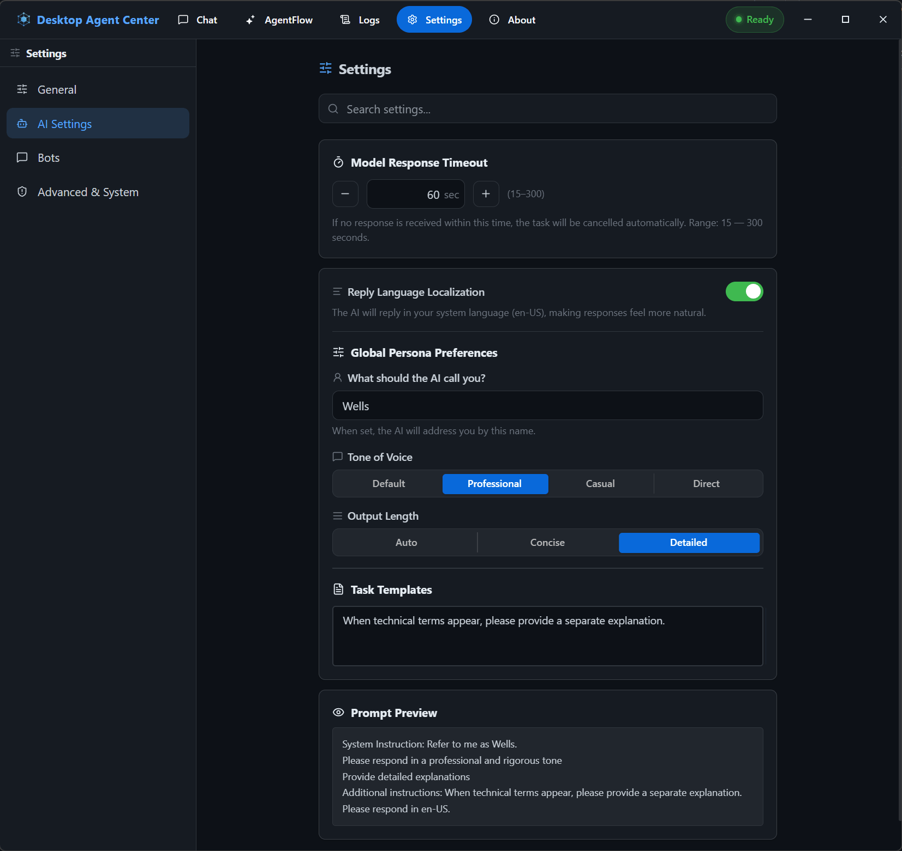
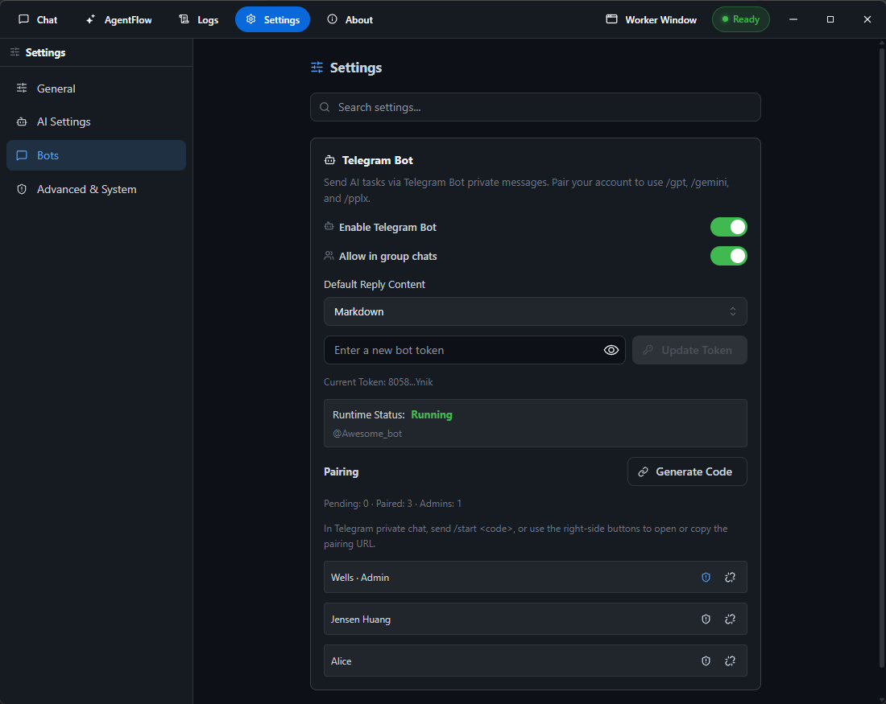

<div align="center">

# 🤖 Desktop Agent Center

**免费、无需 API Key 的 AI 自动化桌面应用**

[](LICENSE)
[](#-快速上手)
[](https://www.electronjs.org/)
[](#-亮点功能)
[](https://github.com/WellWells/desktop-agent-center/pulls)

**[English](README.md) · [简体中文](README.zh-CN.md) · [繁體中文](README.zh-TW.md) · [日本語](README.ja.md)**

</div>

---

**Desktop Agent Center（DAC）** 是一款本地优先的开源 AI 自动化工具，直接运行在你的桌面上。它将系统剪贴板与全局热键直接对接主流 AI 服务——**ChatGPT、Gemini、Perplexity、Duck.ai**——无需 API Key，无需订阅，无需信用卡。

不同于 OpenClaw、Zapier AI、n8n 云端版等从第一天就开始收费的付费自动化平台，DAC **完全免费**，复用你浏览器中已打开的 AI 网页界面。安装完成后，按下热键，剪贴板内容即刻由 AI 处理。

---

## 目录

- [🤖 Desktop Agent Center](#-desktop-agent-center)
  - [目录](#目录)
  - [✨ 亮点功能](#-亮点功能)
  - [🚀 快速上手](#-快速上手)
    - [环境要求](#环境要求)
    - [安装与运行](#安装与运行)
    - [首次使用（4 步）](#首次使用4-步)
  - [📸 截图预览](#-截图预览)
  - [📦 预构建下载](#-预构建下载)
  - [🔗 AgentFlow — 可视化工作流自动化](#-agentflow--可视化工作流自动化)
    - [触发方式](#触发方式)
    - [技能](#技能)
    - [变量系统](#变量系统)
    - [内置工作流模板](#内置工作流模板)
  - [📱 Telegram Bot 集成](#-telegram-bot-集成)
    - [内置 Bot 指令](#内置-bot-指令)
  - [⚙️ 设置与自定义](#️-设置与自定义)
    - [提示词偏好](#提示词偏好)
    - [截图与导出](#截图与导出)
    - [通用设置](#通用设置)
    - [配置备份](#配置备份)
  - [⚖️ DAC vs. 付费工具](#️-dac-vs-付费工具)
  - [🔒 安全与隐私](#-安全与隐私)
  - [🛠️ 开发指南](#️-开发指南)
    - [技术栈](#技术栈)
  - [🤝 参与贡献](#-参与贡献)
  - [📜 开源许可](#-开源许可)

---

## ✨ 亮点功能

|     | 功能              | 说明                                                                        |
| --- | ----------------- | --------------------------------------------------------------------------- |
| 🆓   | **零成本**        | 无 API Key、无信用卡、无订阅费——永久免费                                    |
| ⌨️   | **全局热键**      | `Alt+G`（Windows）/ `Command+G`（macOS）捕获选中文字或剪贴板，立即发送给 AI |
| 🤖   | **多服务商**      | ChatGPT · Gemini · Perplexity · Duck.ai                                     |
| 🔁   | **AgentFlow**     | 可视化无代码工作流构建器，内置 12 种自动化技能                              |
| 📱   | **Telegram 集成** | 通过 Telegram Bot 从手机远程操控 AI 代理                                    |
| 💾   | **自动保存**      | 结果以 Markdown 格式附带时间戳保存到本地                                    |
| 🎨   | **截图与导出**    | 将 AI 回复导出为精美的 PNG、WebP 或 PDF 文件                                |
| 🔒   | **本地优先**      | 所有逻辑在本机运行，无遥测、无追踪                                          |
| 🌍   | **9 种界面语言**  | English、繁中、简中、日本語、한국어、Deutsch、Español、Français、Português  |

---

## 🚀 快速上手

### 环境要求

- **Node.js 20+**（[下载](https://nodejs.org/)）

### 安装与运行

```bash
git clone https://github.com/WellWells/desktop-agent-center.git
cd desktop-agent-center
npm install
npm run dev
```

### 首次使用（4 步）

1. **登录**（可选）——在内置浏览器窗口中登录 ChatGPT / Gemini / Perplexity。
2. **开启托盘**——前往 **设置 → 通用 → 系统托盘**，启用最小化到托盘，保持 DAC 后台运行。
3. **选中文字**——在任意应用中高亮选中文字。
4. **按下 `Alt+G`**——DAC 将其发送给 AI，结果自动写回剪贴板并保存。

> **提示：** 热键可在 **设置 → 通用 → 热键** 中自定义。macOS 默认为 `Command+G`。

---

## 📸 截图预览

|                          主聊天界面                           |                          模型选择菜单                          |
| :-----------------------------------------------------------: | :------------------------------------------------------------: |
|  |  |
|                   与 AI 对话——无需 API Key                    |       在 ChatGPT · Gemini · Perplexity · Duck.ai 间切换        |

|                            对话历史与摘要                             |                             导出选项                             |
| :-------------------------------------------------------------------: | :--------------------------------------------------------------: |
|  |  |
|                         自动保存并附带时间戳                          |             导出为 PNG、WebP 或 PDF，支持自定义样式              |

|                               自定义回复设置                                |                           Telegram Bot 配置                            |
| :-------------------------------------------------------------------------: | :--------------------------------------------------------------------: |
|  |  |
|                         设置语气、长度与自定义指令                          |                        几秒内完成 Bot 连接配置                         |

<div align="center">


**AgentFlow** — 抓取各 URL 内容、逐条 LLM 摘要，并推送至 Telegram——无需编写代码

</div>

---

## 📦 预构建下载

从 [**Releases**](https://github.com/WellWells/desktop-agent-center/releases) 页面下载最新版：

| 平台    | 格式                                   |
| ------- | -------------------------------------- |
| Windows | NSIS 安装包 · 便携版 `.exe`（x64）     |
| macOS   | DMG · ZIP（x64 & Apple Silicon arm64） |

---

## 🔗 AgentFlow — 可视化工作流自动化

AgentFlow 是 DAC 的可视化自动化引擎。将 **LLM 调用、数据源与 Telegram 输出**串成全自动流水线——无需编写代码。可通过热键、定时计划或 Telegram 指令触发。

### 触发方式

| 触发方式       | 说明                                             |
| -------------- | ------------------------------------------------ |
| ⌨️ **热键**     | 独立的全局键盘快捷键                             |
| ⏰ **定时调度** | 每日 / 每周 Cron 计划，支持灵活重复设置          |
| 🤖 **Bot 指令** | 自定义 Telegram Bot 指令（如 `/my_cmd <input>`） |
| ▶️ **手动执行** | 在 AgentFlow 界面按需运行                        |

### 技能

| 技能                  | 说明                                                                                  |
| --------------------- | ------------------------------------------------------------------------------------- |
| 🧠 **LLM**             | 向 ChatGPT、Gemini、Perplexity 或 Duck.ai 发送提示词；可选导出回复为 PNG / WebP / PDF |
| 🌐 **浏览器**          | 抓取并提取任意 URL 的文本内容                                                         |
| 📡 **RSS**             | 监控 RSS/Atom 订阅源——仅返回上次运行后的新条目                                        |
| 🕵️ **网络爬虫**        | 通过 CSS 选择器从任意网页提取链接与标题，输出为 JSON                                  |
| 🐚 **Shell**           | 执行 Shell 命令（Windows 支持 cmd / PowerShell；macOS 支持 bash / zsh）               |
| 📋 **剪贴板**          | 读取或写入系统剪贴板的文本内容                                                        |
| 📨 **Bot**             | 向 Telegram 聊天发送消息或文件                                                        |
| 🔁 **循环 / 结束循环** | 逐行迭代列表项目                                                                      |
| 🛠️ **工具**            | 添加延迟或导出渲染快照（PNG / WebP / PDF）                                            |
| ⏹ **停止**            | 当变量为空时有条件地中止工作流                                                        |
| 💬 **注释**            | 为步骤添加说明文字（不执行）                                                          |

### 变量系统

每个步骤将结果写入命名变量，后续步骤通过 `{{变量名}}` 引用：

```
RSS 订阅        → 输出: rss_1
LLM 提示        → "请总结：{{rss_1}}"   → 输出: llm_1
Telegram Bot   → 消息: "{{llm_1}}"
```

### 内置工作流模板

| 模板                      | 说明                                          |
| ------------------------- | --------------------------------------------- |
| 📰 **RSS → Telegram**      | 抓取 RSS 源，LLM 摘要，发送到 Telegram        |
| 🕵️ **网络爬虫 → Telegram** | 爬取任意网站新内容，LLM 分析后推送到 Telegram |

流程可导出为 `.json` 文件**分享**，也支持通过文件或 URL **导入**。

---

## 📱 Telegram Bot 集成

将 DAC 连接到 Telegram，随时随地远程控制你的 AI 代理：

1. **创建 Bot**——在 Telegram 中向 [@BotFather](https://t.me/BotFather) 发消息，获取 Bot Token。
2. **填入 Token**——进入 **设置 → Telegram**，粘贴 Token。
3. **绑定账号**——向你的 Bot 发送 `/start` 并完成绑定流程。

### 内置 Bot 指令

| 指令               | 说明                  |
| ------------------ | --------------------- |
| `/gpt <提示词>`    | 发送提示给 ChatGPT    |
| `/gemini <提示词>` | 发送提示给 Gemini     |
| `/pplx <提示词>`   | 发送提示给 Perplexity |
| `/status`          | 查看代理状态          |

在 AgentFlow 中使用 **Bot 指令触发器**，可创建完全自定义的工作流。

---

## ⚙️ 设置与自定义

### 提示词偏好

自定义每次发送给 AI 的提示词方式：

| 选项           | 可选值                                 |
| -------------- | -------------------------------------- |
| **语气**       | 默认 · 专业 · 轻松 · 直接              |
| **长度**       | 自动 · 精简 · 详细                     |
| **自定义指令** | 自由格式的系统级引导，附加到每次提示词 |
| **模板**       | 保存并复用你自己的提示词模板           |

### 截图与导出

将任何 AI 回复导出为精美图片或 PDF：

- **格式**：PNG · WebP · PDF
- **选项**：渐变色板、布局方向、显示/隐藏提示词文本、服务商名称和时间戳

### 通用设置

| 设置              | 说明                               |
| ----------------- | ---------------------------------- |
| **主题**          | 浅色 · 深色 · 自动（跟随系统）     |
| **布局**          | 堆叠 · 左右并排                    |
| **响应超时**      | AI 响应的最大等待时间              |
| **开机自启**      | 电脑开机时自动启动 DAC             |
| **关闭至托盘**    | 关闭窗口时最小化到系统托盘而非退出 |
| **Markdown 缩放** | 调整回复文字大小（70%–200%）       |

### 配置备份

通过 **设置 → 高级** 将完整配置导出或导入为 JSON 文件。

---

## ⚖️ DAC vs. 付费工具

|               | Desktop Agent Center           | OpenClaw / n8n Cloud / Zapier AI |
| ------------- | ------------------------------ | -------------------------------- |
| 价格          | **永久免费**                   | 付费订阅 / 按量计费              |
| API Key       | **无需**                       | 通常需要                         |
| AI 服务商     | ChatGPT、Gemini、PPLX、Duck.ai | 取决于套餐                       |
| 工作流自动化  | ✅ AgentFlow（可视化）          | ✅（付费）                        |
| Telegram 集成 | ✅ 内置                         | 不一定                           |
| 数据隐私      | **本地优先**                   | 云端处理                         |
| 开源          | ✅ MIT                          | 不一定                           |

---

## 🔒 安全与隐私

- **无遥测** — 零分析、零追踪脚本、零用户行为数据收集。
- **本地执行** — 所有自动化均在本机运行，数据直接发送给你选择的 AI 服务商。
- **凭据加密** — Telegram Bot Token 使用 Electron `safeStorage`（系统级密钥链）加密后写入磁盘。
- **第三方服务商政策** — ChatGPT / Gemini / Perplexity 处理的查询受其各自隐私政策约束，作者对这些平台无控制权。
- **开源可审计** — 所有自动化逻辑均可在 `src/main/` 目录中审查。

---

## 🛠️ 开发指南

```bash
# 启动开发服务器（含 Electron 热重载）
npm run dev

# TypeScript 类型检查
npm run typecheck

# i18n Key 审计
npm run i18n:check

# 构建 Windows（NSIS + 便携版）
npm run build:win

# 构建 macOS（DMG + ZIP）
npm run build:mac
```

### 技术栈

| 层级      | 技术                      |
| --------- | ------------------------- |
| 运行时    | Electron 42 + Node.js 20  |
| 前端      | React 19 + TypeScript     |
| UI 组件库 | Mantine 9                 |
| 状态管理  | Zustand 5                 |
| 构建工具  | Vite 8 + electron-builder |
| Telegram  | GrammY                    |
| 定时任务  | node-cron                 |

---

## 🤝 参与贡献

欢迎提交 Issue、Feature Request 和 Pull Request！

1. **Fork** 仓库并创建功能分支（`git checkout -b feat/my-feature`）。
2. 完成修改——确保 `npm run typecheck` 无报错通过。
3. 提交 **Pull Request**，附上清晰的描述。

重大变更请先开 **Issue** 讨论方案。

---

## 📜 开源许可

本项目基于 **[MIT 许可证](LICENSE)** 开源——自由使用、修改与分发。

---

<div align="center">

如果 DAC 为你节省了时间或金钱，请 ⭐ **Star** 这个仓库——让更多人发现它！

**[报告 Bug](https://github.com/WellWells/desktop-agent-center/issues) · [功能建议](https://github.com/WellWells/desktop-agent-center/issues) · [讨论区](https://github.com/WellWells/desktop-agent-center/discussions)**

</div>
