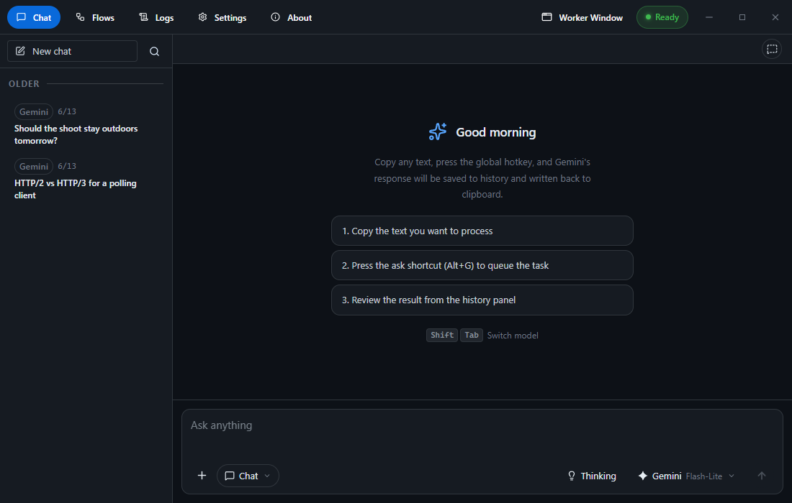
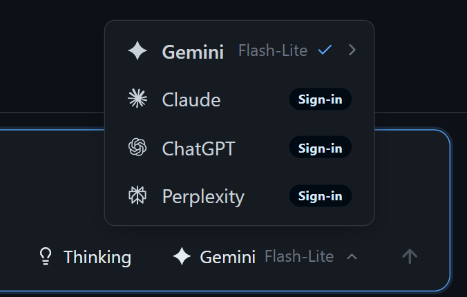
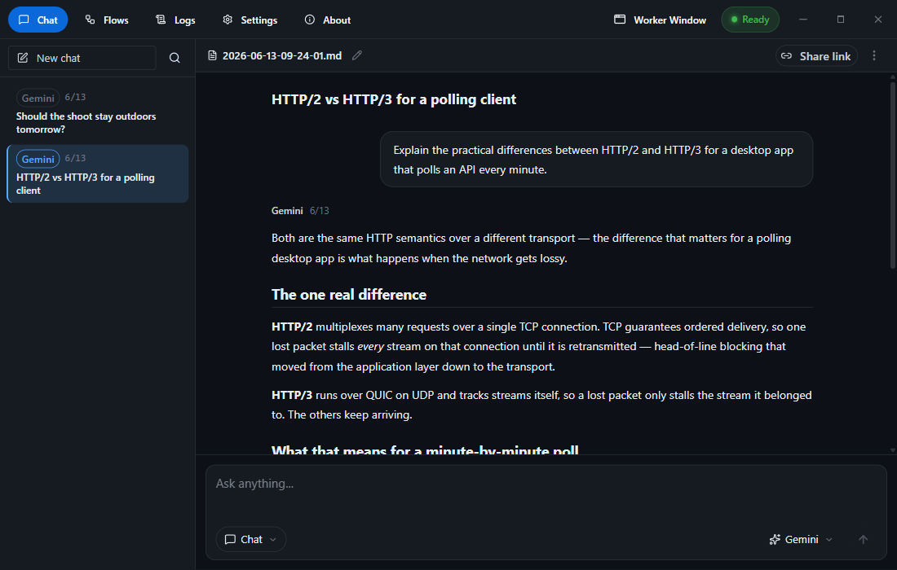
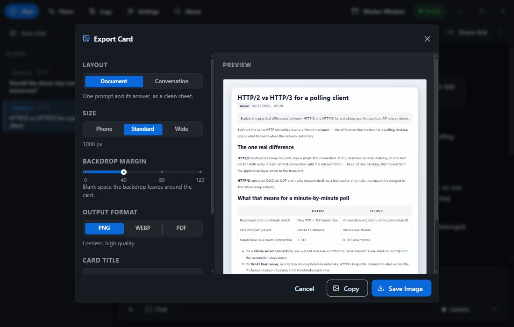
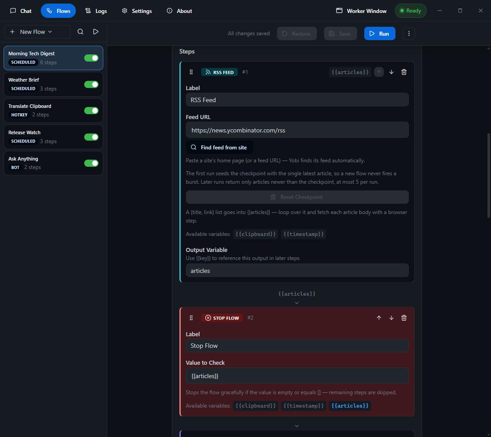

<div align="center">

# 🤖 Yobi

**一个热键，畅用 ChatGPT、Gemini、Perplexity 与 Duck.ai——还能用无代码方式自动化它们。无需 API Key。**

[](LICENSE)
[](#-快速上手)
[](https://apps.microsoft.com/detail/9nnx8prfstc9)
[](https://www.electronjs.org/)
[](https://github.com/WellWells/yobi/pulls)

**[English](README.md) · [简体中文](README.zh-CN.md) · [繁體中文](README.zh-TW.md)**

</div>

---

**Yobi** 把你早已在用的 AI 网站——**ChatGPT、Gemini、Perplexity 与 Duck.ai**——变成一个由全局热键唤起的桌面助手，也是一台可定时运行、可从 Telegram 或 LINE 触发的无代码自动化引擎。无需 API Key，也没有额外费用：它在内置浏览器中驱动服务商自己的网页，就像你亲自操作一样。

> ℹ️ 须知：自动化这些网站并非服务商官方支持的用法，也不在其服务条款的许可范围内。Yobi 不会绕过任何技术保护——一旦网站弹出 CAPTCHA，它会暂停并把控制权交还给你。请负责任地使用。[运作原理 →](#-yobi-如何运作)

---

## ✨ 为什么选 Yobi

|     | 功能                 | 对你意味着什么                                                                 |
| --- | -------------------- | ----------------------------------------------------------------------------- |
| ⌨️   | **一个热键**         | 在任何地方选中文字，按下 `Alt+G`（macOS 为 `⌘G`）即得答案——并自动保存          |
| 🔑   | **无需 API Key**     | 使用服务商的网页，而非付费 API——无需注册、无需付费。已经有 Key？可选的 BYOK 模式也支持 |
| 🤖   | **主流 AI 全覆盖**   | ChatGPT · Gemini · Perplexity · Duck.ai，一键切换                              |
| 🧠   | **代理与搜索**       | `/agent` 接下一个目标就一路做到完；`/search` 从网上找答案，附可点击的来源       |
| 🔁   | **无代码自动化**     | 拖拽步骤即可搭建工作流——或只需描述一下，让 AI 替你组装                         |
| 📱   | **Telegram 与 LINE** | 在手机上触发你的 AI 与自动化流程                                               |
| 🎨   | **即分享的输出**     | 将任意回复导出为精美的 PNG、WebP 或 PDF——或一条加密分享链接                    |
| 🔒   | **没有中间人**       | Yobi 没有自己的服务器：提示词直接送到你选的 AI 网站，其余一切都留在你的硬盘上   |
| 🌍   | **多语言**         | 内置 English · 繁體中文 · 简体中文,放入语言包即可自行新增任何语言([说明](language/README.md)) |

---

## 🚀 快速上手

**1. 下载** 适合你系统的最新版本：

| 平台        | 下载                                                                                          | 说明                                                                                              |
| ----------- | --------------------------------------------------------------------------------------------- | ------------------------------------------------------------------------------------------------- |
| **Windows** | [**Microsoft Store**](https://apps.microsoft.com/detail/9nnx8prfstc9)（推荐）                 | 自动安装并自动更新。                                                            |
| **Windows** | [GitHub Releases](https://github.com/WellWells/yobi/releases) — NSIS 安装包（x64）            | 未签名，首次启动时 Windows 会弹出提示——选择 **更多信息 → 仍要运行** 即可打开。   |
| **macOS**   | [GitHub Releases](https://github.com/WellWells/yobi/releases) — DMG（Intel 与 Apple Silicon） | 未签名，首次启动会被 macOS Gatekeeper 拦截——[release 页面](https://github.com/WellWells/yobi/releases) 附有打开教程。 |

**2. 30 秒内获得你的第一个答案：**

1. （可选）打开应用内浏览器，登录 ChatGPT / Gemini / Perplexity。
2. 在任意应用中高亮选中文字。
3. 按下 **`Alt+G`**——Yobi 会把它发送给你选定的 AI，并将回复保存为带时间戳的 Markdown 文件。

> 热键、AI 服务商与托盘行为都可在 **设置** 中配置。

<details>
<summary><b>改为从源码运行</b>（Node.js 20+）</summary>

```bash
git clone https://github.com/WellWells/yobi.git
cd yobi
npm install
npm run dev
```
</details>

---

## 📸 截图预览

|                          主聊天界面                           |                          模型选择菜单                          |
| :-----------------------------------------------------------: | :------------------------------------------------------------: |
|  |  |
|                    通过网页界面与 AI 对话                     |       在 ChatGPT · Gemini · Perplexity · Duck.ai 间切换        |

|                            对话历史与摘要                             |                             导出选项                             |
| :-------------------------------------------------------------------: | :--------------------------------------------------------------: |
|  |  |
|                         自动保存并附带时间戳                          |             导出为 PNG、WebP 或 PDF，支持自定义样式              |

<div align="center">



**流程** — 抓取内容、用 AI 摘要，并按计划发送到 Telegram——无需代码

</div>

---

## 💬 提问、搜索，或整件事交给它

在聊天输入框敲 `/` 选择模式——或者直接开口：

| 模式 | 作用 |
| --- | --- |
| **聊天** | 普通的多轮对话。每段对话就是一个 Markdown 文件，关掉之后还能打开接着聊。 |
| `/agent` | 给它一个目标。它会自己规划、读网页、调用工具、检查自己的成果，也能顺手帮你建一条流程。 |
| `/search` | 上网查，答案附带编号来源，可直接点开。 |
| `/你的指令` | 你自己建的任意一条流程，都能变成你的斜杠指令。 |

回答边生成边渲染——**Mermaid 图表**、数学公式与代码都包含在内——每段对话还会记录 token 用量。任意一段都能一键变成 **PNG、PDF，或一条端到端加密的分享链接**。

---

## 🔗 流程 — 无代码自动化

把 AI、数据与动作串成自动化流程，可通过**热键、定时计划、Telegram 指令，或应用内的 `/指令`** 触发——同一条流程还能同时使用多种方式。

**从没做过自动化？你不需要会。** 只需用大白话描述你想要什么，AI 就会为你搭好整条流程：

> *「每个工作日早上 8 点，总结我的 RSS 订阅并发送到 Telegram。」* → 🪄 一条完整、即开即用的流程，为你自动生成。

想再微调？每一步都可编辑——也可以从零开始，自己拖拽搭建。

**你可以串联起这些能力：**

- 📥 **抓取数据**——网页、RSS、HTTP API、YouTube 字幕、网络搜索、Google 地图评论，甚至实时的股票 / 外汇 / 天气 / 空气质量——无需 API Key
- 🕸️ **抓取列表**——在真实页面上点一条标题，Yobi 自己推算出整份列表的选择器
- 🌐 **驱动浏览器**——打开标签页、点击、填写表单、截图
- 🧠 **询问 AI**——ChatGPT · Gemini · Perplexity · Duck.ai——或通过 BYOK 使用你自己的 API Key
- 🔌 **接入你自己的工具**——连接远程 MCP 服务器，让 `/agent` 直接调用
- 📤 **发送结果**——Telegram、LINE、邮件、文件、分享链接，或剪贴板
- 🛠️ **运行任意内容**——程序、JavaScript、Shell，以及系统与电源控制
- 🔀 **控制流程**——循环、条件、定时调度，以及「有变化才通知我」

……**46 种技能且仍在增加**，全部通过简单的 `{{variables}}` 串联——每一步的输出都喂给下一步。

**从模板开始** 并自定义：

| 模板                                      | 功能                                                                 |
| ----------------------------------------- | -------------------------------------------------------------------- |
| 📰 **RSS → Telegram**                      | 用 AI 摘要一个订阅源并发送到 Telegram                                |
| 🕵️ **网站监控 → Telegram**                 | 监控任意网站的新内容，分析后推送到 Telegram                          |
| ▶️ **YouTube 订阅 → Telegram**             | 摘要你关注频道的新视频，并附带缩略图                                 |

流程就是普通的 `.json` 文件——一键导出、分享与导入。

---

## 📱 从 Telegram 或 LINE 运行

想在手机上使用你的 AI？连接一个 Bot——大约两分钟：

1. **创建 Bot**——给 [@BotFather](https://t.me/BotFather) 发消息，复制它给你的 Token。（LINE 则是创建一个 Messaging API channel。）
2. **填入 Token**——在 **设置 → Telegram**（或 **LINE**）中粘贴。
3. **发送 `/start`**——向你的 Bot 发送并按提示完成绑定。搞定。

现在就能随时随地给你的 Bot 发消息：

| 指令               | 作用                                                 |
| ------------------ | ---------------------------------------------------- |
| `/gpt` · `/gemini` · `/pplx` · `/duck` | 询问对应服务商（指令可自定义）   |
| `/agent` · `/search` | 交给它一个目标，或搜索网络——与 App 内一致           |
| `/new`             | 开始一段全新的对话                                   |
| `/output <模式>`   | 设置回复格式——`md` · `png` · `webp` · `pdf`          |
| `/status`          | 查看 AI 状态                                         |
| `/restart`         | 重启 Yobi（管理员）                                  |

完全不想打指令？在该 Bot 的设置里开启**免指令对话**，之后直接发消息就会当成普通对话送给你的 AI。

在「流程」中用 **Bot 触发器**打造你自己的指令——任意消息都能启动一条流程，两个平台皆可。

---

## ⚙️ 设置与自定义

- **提示词偏好**——设置默认语气与长度，并在每条提示词前加上你自己的引导指令。
- **截图与导出**——把任意回复变成精美的 PNG / WebP / PDF（浅色或深色卡片、渐变色板、自选元数据）。
- **邮件（SMTP）**——让流程通过邮件发送结果；密码保存在操作系统密钥链中，绝不会写入流程文件。
- **MCP 服务器**——添加远程 Model Context Protocol 服务器，让 `/agent` 使用它们的工具；任何写入操作都会先征询你。
- **账号**——按服务商分别登录或登出，一键重置某个服务商的数据以修复卡死的会话。
- **自备密钥（BYOK）**——可选择添加你自己的 OpenAI 兼容（OpenAI、OpenRouter、Together、Groq、本地服务器…）或 Gemini API 密钥作为额外服务商：选类型、填 base URL／模型／密钥，再用「**加载模型**」从端点支持的列表挑选、用「**测试**」确认能通。BYOK 实例在聊天与流程中和其他服务商一样选用；浏览器模式仍是默认，密钥以操作系统密钥链加密存储。
- **外观与行为**——11 款主题、堆叠或左右并排布局、开机自启、关闭至托盘、响应超时、文字缩放。
- **配置备份**——将全部设置导出和导入为单个 JSON 文件。

---

## 🔍 Yobi 如何运作

Yobi 自动化 ChatGPT、Gemini、Perplexity 与 Duck.ai 的**网页界面**。它在内置浏览器窗口中，把你的提示词输入服务商的网页，再从页面读回答案——就和你亲手操作一样。只有需要登录的服务商才在该窗口里登录。默认**不使用官方 API，也不运行本地模型**——这正是它无需 API Key、也没有任何费用的原因。（如果你有 Key，可选的 BYOK 模式会改为直接调用任何 OpenAI 兼容端点或 Gemini API——以下说明均针对默认的浏览器模式。）

由于它使用的是网页而非官方 API，这**并不在服务商服务条款的许可范围内**。不过 Yobi 不会隐瞒这一点——它不会绕过任何保护措施：不破解 CAPTCHA、不规避速率限制、也不轮换 IP。所以你真正会遇到的，是反机器人检查（类似 Cloudflare 的「确认你不是机器人」页面）；一旦发生，Yobi 会暂停，把控制权交还给你手动完成。

**请负责任地使用 Yobi**——不做任何非法之事，也不进行大规模或恶意的自动化。轻度的个人使用通常只会偶尔遇到一次验证；大量或恶意的使用才是会被封锁的情形。是否在此前提下使用由你决定——本说明不构成法律意见，而且服务商的条款可能变化，请自行查阅。

---

## 🔒 安全与隐私

- **你的提示词会去哪里**——发送到你选的那个 AI 网站，输入在它自己的网页上，就跟你亲手敲进去一样。那是你的文字唯一会去的地方，受该服务商的隐私政策约束。
- **没有中间人、没有遥测**——Yobi 没有服务器、也没有账号：不经我们中转，零分析、零追踪。
- **你的东西还是你的**——对话、流程与导出文件都是你硬盘上的普通文件。自动化逻辑可在 `src/main/` 中审查。
- **其余会离开本机的功能，一律由你主动开启**——分享链接在 App 内先加密再上传，密钥放在链接的 `#fragment` 中，浏览器不会把它发给主机（你随时可以删除该条内容）。MCP 只会连接你自己添加的服务器。
- **凭据加密**——你的 Telegram／LINE Token、SMTP 密码与 BYOK API 密钥在写入磁盘前，均使用操作系统密钥链（Electron `safeStorage`）加密。

---

## 🛠️ 开发

```bash
npm run dev         # dev server with Electron hot-reload
npm run typecheck   # TypeScript type checking
npm run i18n:check  # i18n key audit
npm run build:win   # build Windows (NSIS installer)
npm run build:mac   # build macOS (DMG)
```

**技术栈：** Electron · React + TypeScript · Mantine · Zustand · Vite + electron-builder · grammY · LINE Bot SDK · MCP SDK

---

## 🤝 参与贡献

欢迎提交 Issue 和 PR！Fork 仓库、创建分支（`git checkout -b feat/my-feature`），确保 `npm run typecheck` 通过，然后提交一个附有清晰描述的 PR。重大变更请先开 Issue 讨论方案。

---

## 📜 开源许可

[**MIT**](LICENSE) — 自由使用、修改与分发。

---

<div align="center">

如果 Yobi 为你节省了时间，请 ⭐ **Star** 这个仓库——让更多人发现它！

**[报告 Bug](https://github.com/WellWells/yobi/issues) · [功能建议](https://github.com/WellWells/yobi/issues) · [讨论区](https://github.com/WellWells/yobi/discussions)**

</div>
