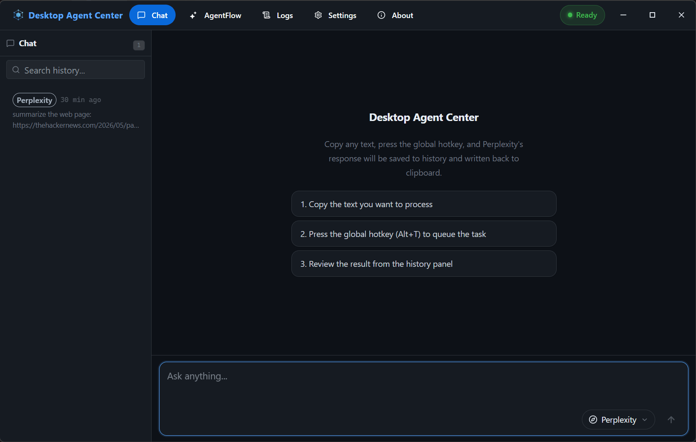
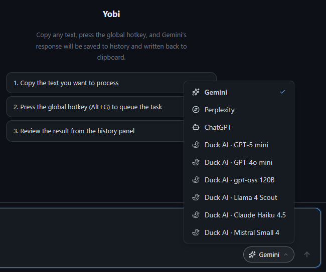
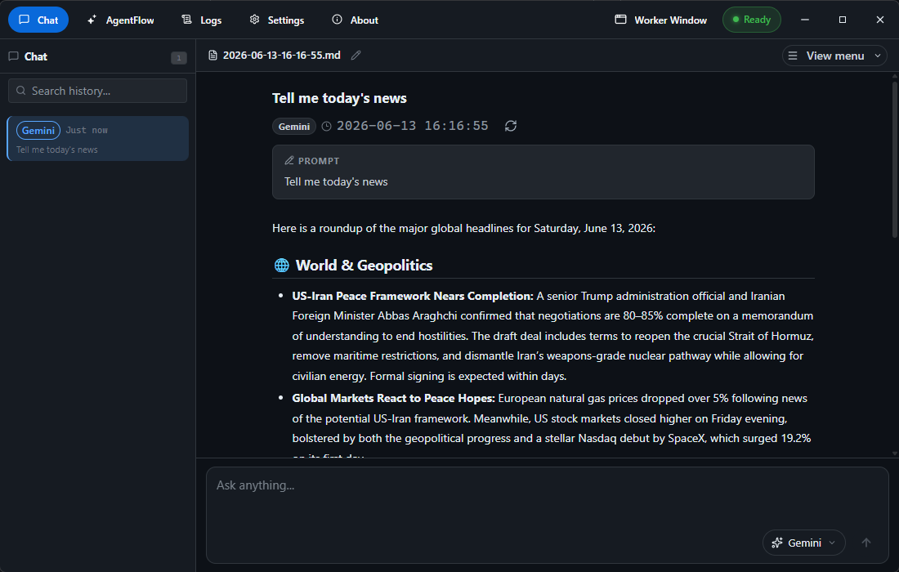
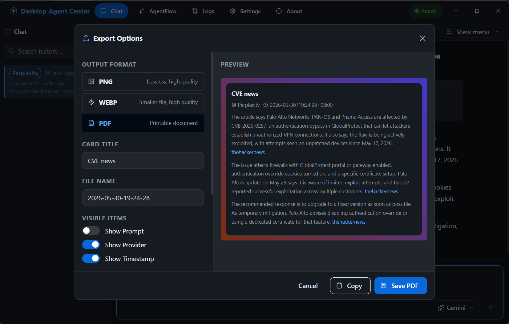
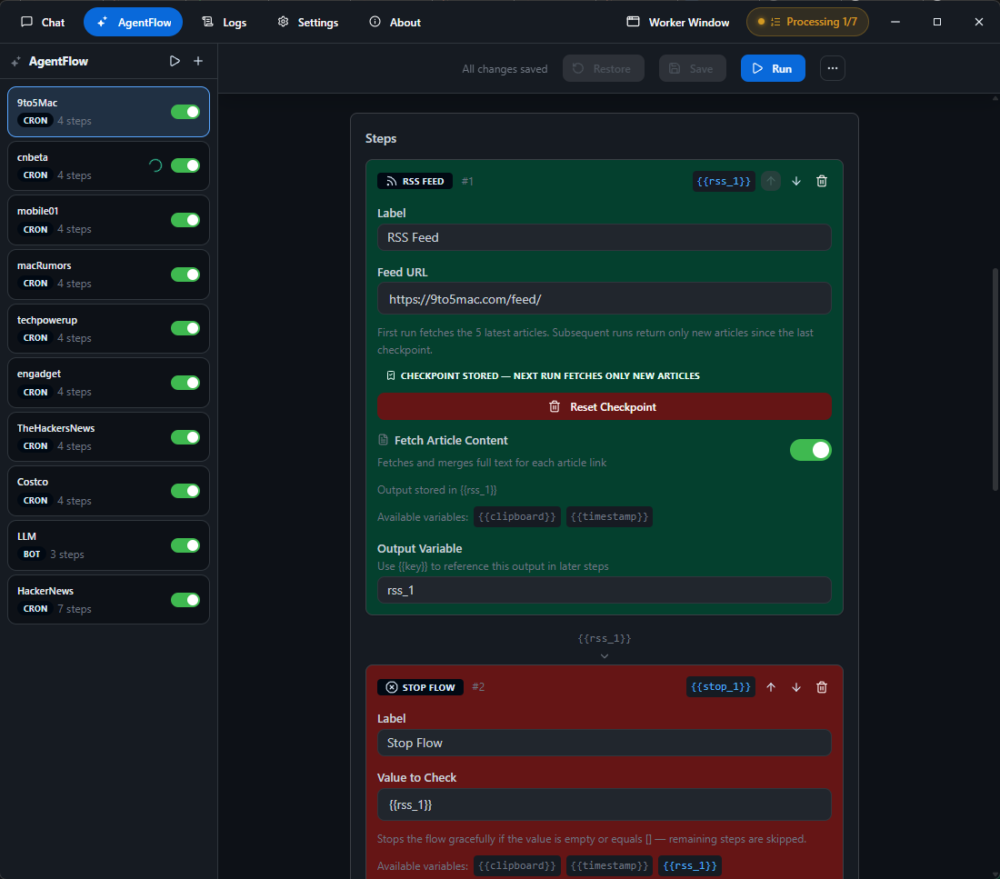

<div align="center">

# 🤖 Yobi

**一個熱鍵，呼叫 ChatGPT、Gemini、Perplexity 與 Duck.ai——再用零程式碼把它們自動化。無需 API 金鑰。**

[](LICENSE)
[](#-快速上手)
[](https://www.electronjs.org/)
[](https://github.com/WellWells/yobi/pulls)

**[English](README.md) · [简体中文](README.zh-CN.md) · [繁體中文](README.zh-TW.md) · [日本語](README.ja.md)**

</div>

---

**Yobi** 把你早已在用的 AI 網站——**ChatGPT、Gemini、Perplexity 與 Duck.ai**——變成一個用全域熱鍵就能呼叫的桌面助理，以及一套可排程、也能從 Telegram 觸發的無程式碼自動化引擎。不需要 API 金鑰、也沒有額外費用：它在內建瀏覽器中直接驅動服務商自家的網頁，就和你親自操作時一模一樣。

> ℹ️ 補充說明：自動化這些網頁並非服務商官方支援的用法，也不在其服務條款的允許範圍內。Yobi 不會繞過任何防護——當網站跳出 CAPTCHA，它會暫停，把控制權交還給你。請負責任地使用。[它如何運作 →](#-yobi-如何運作)

---

## ✨ 為什麼選 Yobi

|     | 功能 | 對你的意義 |
| --- | --- | --- |
| ⌨️ | **一個熱鍵** | 在任何地方選取文字，按下 `Alt+G`（macOS 為 `⌘G`）就有答案——還會自動存檔 |
| 🔑 | **無需 API 金鑰** | 用的是服務商的網頁，而非付費 API——不必註冊、不必付費 |
| 🤖 | **主流 AI 全到齊** | ChatGPT · Gemini · Perplexity · Duck.ai，一鍵切換 |
| 🔁 | **零程式碼自動化** | 拖拉步驟就能組工作流程——或直接用一句話描述，讓 AI 幫你組起來 |
| 📱 | **從 Telegram 操控** | 用手機就能啟動你的 AI 與自動化流程 |
| 🎨 | **成品隨手分享** | 把任何回答匯出成精美的 PNG、WebP 或 PDF |
| 🔒 | **完全屬於你** | 全部在你的電腦上執行——無遙測、無追蹤、開放原始碼 |
| 🌍 | **9 種語言** | English · 繁中 · 简中 · 日本語 · 한국어 · Deutsch · Español · Français · Português |

---

## 🚀 快速上手

**1. 下載**適合你作業系統的最新版本：

| 平台 | 下載 |
| --- | --- |
| Windows | NSIS 安裝程式（x64） |
| macOS | DMG（Intel 與 Apple Silicon） |

→ [**Releases 頁面**](https://github.com/WellWells/yobi/releases)

**2. 30 秒內得到第一個答案：**

1. （可選）開啟 App 內建瀏覽器，登入 ChatGPT / Gemini / Perplexity。
2. 在任何應用程式中反白選取文字。
3. 按下 **`Alt+G`**——Yobi 會把它送給你選定的 AI，並將回應存成附帶時間戳記的 Markdown 檔案。

> 熱鍵、AI 服務商與系統匣行為都能在 **設定** 中調整。

<details>
<summary><b>改用原始碼執行</b>（Node.js 20+）</summary>

```bash
git clone https://github.com/WellWells/yobi.git
cd yobi
npm install
npm run dev
```
</details>

---

## 📸 截圖預覽

|                      主要聊天介面                      |                        模型選擇                         |
| :-----------------------------------------------------------: | :------------------------------------------------------------: |
|  |  |
|            透過網頁介面與 AI 對話             |     在 ChatGPT · Gemini · Perplexity · Duck.ai 間切換     |

|                        對話紀錄與摘要                         |                          匯出選項                          |
| :-------------------------------------------------------------------: | :--------------------------------------------------------------: |
|  |  |
|                 附時間戳記自動儲存的回應                  |          匯出為 PNG、WebP 或 PDF，支援自訂樣式          |

<div align="center">



**AgentFlow** — 排程擷取內容、用 AI 摘要、再送到 Telegram——全程零程式碼

</div>

---

## 🔗 AgentFlow — 零程式碼自動化

把 AI、資料與動作串成自動化流程，由**熱鍵、排程、Telegram 指令，或 App 內的 `/指令`** 觸發——而且單一流程可以同時用上好幾種。

**從沒做過自動化？沒關係，你不需要會。** 只要用白話描述你想要什麼，AI 就會幫你把整條流程建好：

> *「每個工作日早上 8 點，摘要我的 RSS 訂閱並傳送到 Telegram。」* → 🪄 一條完整、可立即執行的流程，自動為你生成。

想再微調？每個步驟都能編輯——也可以從零開始自己拖拉組裝。

**你能串接的東西：**

- 📥 **抓取資料** — 網頁、RSS、HTTP API、YouTube 字幕，甚至即時的股票 / 外匯 / 天氣——全都免 API 金鑰
- 🌐 **操控瀏覽器** — 開分頁、點擊、填表單、截圖
- 🧠 **詢問 AI** — ChatGPT · Gemini · Perplexity · Duck.ai
- 📤 **送出結果** — Telegram、電子郵件、檔案，或剪貼簿
- 🛠️ **執行任何東西** — 程式、JavaScript、shell，外加系統與電源控制
- 🔀 **流程控制** — 迴圈、條件、排程

……**35+ 種技能且持續增加**，全靠簡單的 `{{variables}}` 串接——每個步驟的輸出都餵給下一步。

**從範本開始**再自訂：

| 範本 | 功能 |
| --- | --- |
| 📰 **RSS → Telegram** | 用 AI 摘要訂閱來源並傳送到 Telegram |
| 🕵️ **網站監看 → Telegram** | 監看任何網站的新內容，分析後推播到 Telegram |
| ▶️ **YouTube 訂閱 → Telegram** | 摘要你追蹤頻道的新影片，附上縮圖 |

流程就是單純的 `.json`——一鍵匯出、分享與匯入。

---

## 📱 從 Telegram 操控

想用手機操控你的 AI？連接一個 Telegram bot 就行——大約兩分鐘：

1. **建立 bot** — 在 Telegram 向 [@BotFather](https://t.me/BotFather) 傳訊息，複製它給你的 token。
2. **貼上 token**，位置在 **設定 → Telegram**。
3. **對你的 bot 說 `/start`**，依配對提示完成即可。搞定。

現在隨時隨地都能傳訊息給你的 bot：

| 指令 | 功能 |
| --- | --- |
| `/gpt` · `/gemini` · `/pplx` · `/duck` | 詢問該服務商（指令可自訂） |
| `/output <模式>` | 設定回覆格式——`md` · `png` · `webp` · `pdf` |
| `/status` | 查看代理狀態 |
| `/restart` | 重新啟動 Yobi（管理員） |

在 AgentFlow 裡用 **Telegram 觸發器** 打造你自己的指令——任何訊息都能啟動一條流程。

---

## ⚙️ 設定與自訂

- **提示詞偏好** — 設定預設語調與長度，並在每則提示詞前面加上你自己的指示。
- **擷取與匯出** — 把任何回答變成精美的 PNG / WebP / PDF（淺色或深色卡片、漸層調色盤、自選顯示的中繼資料）。
- **電子郵件（SMTP）** — 讓流程用郵件寄出結果；密碼存在作業系統金鑰圈裡，絕不會寫進流程檔案。
- **帳號** — 逐一登入或登出各服務商，並可一鍵重設某服務商的資料，修復卡住的工作階段。
- **外觀與行為** — 11 款主題、堆疊或並排版面、開機自動啟動、關閉至系統匣、回應逾時、文字縮放。
- **備份** — 把所有設定匯出或匯入為單一 JSON 檔案。

---

## 🔍 Yobi 如何運作

Yobi 自動化 ChatGPT、Gemini、Perplexity 與 Duck.ai 的**網頁介面**。它在內建瀏覽器視窗中，把你的提示詞輸入服務商的網站，再從頁面讀回答案——就和你親手操作一樣。只有需要登入的服務商才得在那裡登入。它**不使用官方 API、也不在本機跑模型**，這正是它不需要 API 金鑰、也沒有費用的原因。

這**並非服務商官方支援的用法，也不在其服務條款的允許範圍內**；不過 Yobi 不會掩飾這一點——它不會繞過任何防護措施：不會破解 CAPTCHA、不會規避速率限制，也不會輪換 IP。所以你真正會碰到的，是反機器人檢查（類似 Cloudflare 的「確認你不是機器人」頁面）；發生時，Yobi 會暫停，把控制權交還給你手動完成。

**請負責任地使用 Yobi**——不做任何非法的事，也不進行大規模或惡意的自動化。輕度的個人使用通常只是偶爾跳出驗證；大量或惡意的使用才是會被封鎖的情形。是否在此前提下使用，由你自己決定——這不是法律意見，而且服務商的條款可能變動，請自行查閱。

---

## 🔒 安全性與隱私

- **無遙測** — 零分析、零追蹤；你的查詢只會送到你選擇的 AI 服務商（並受其各自的隱私權政策規範）。
- **本機執行、開放原始碼** — 每一段自動化邏輯都在你的電腦上執行，並可在 `src/main/` 中查閱稽核。
- **加密憑證** — 你的 Telegram token 與 SMTP 密碼會用作業系統金鑰圈（Electron `safeStorage`）加密後才寫入磁碟。

---

## 🛠️ 開發

```bash
npm run dev         # dev server with Electron hot-reload
npm run typecheck   # TypeScript type checking
npm run i18n:check  # i18n key audit
npm run build:win   # build Windows (NSIS installer)
npm run build:mac   # build macOS (DMG)
```

**技術堆疊：** Electron 42 · React 19 + TypeScript · Mantine 9 · Zustand 5 · Vite 8 + electron-builder · GrammY · node-cron

---

## 🤝 貢獻

歡迎提交 Issue 與 PR！Fork、開分支（`git checkout -b feat/my-feature`）、確認 `npm run typecheck` 通過，再附上清楚的說明開一個 PR。重大變更請先開 Issue 討論。

---

## 📜 授權

[**MIT**](LICENSE) — 自由使用、修改與散布。

---

<div align="center">

如果 Yobi 為你省下時間，請給這個儲存庫一顆 ⭐ **Star**——能幫助更多人發現它！

**[回報錯誤](https://github.com/WellWells/yobi/issues) · [功能建議](https://github.com/WellWells/yobi/issues) · [討論區](https://github.com/WellWells/yobi/discussions)**

</div>
